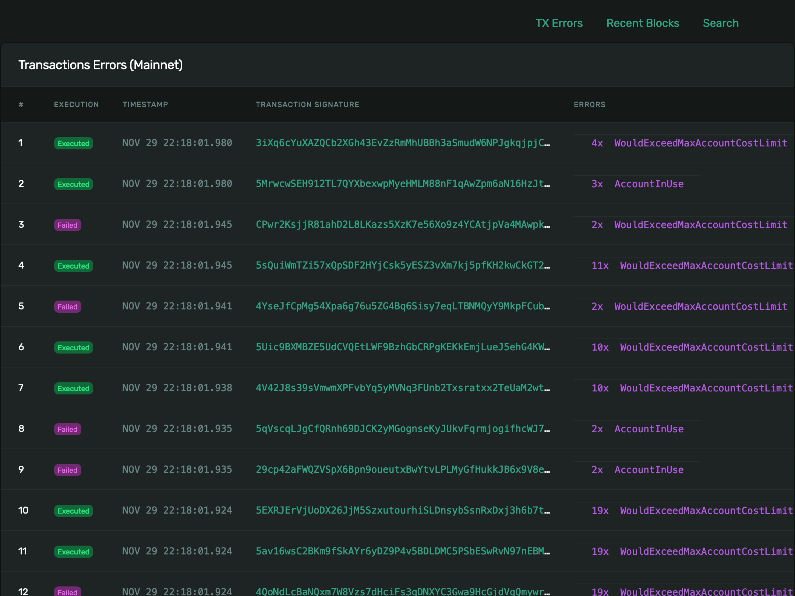
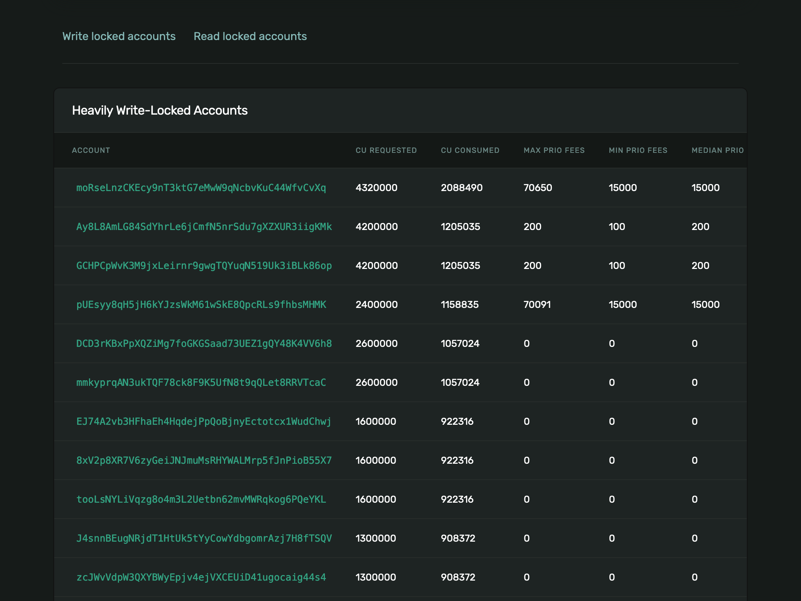
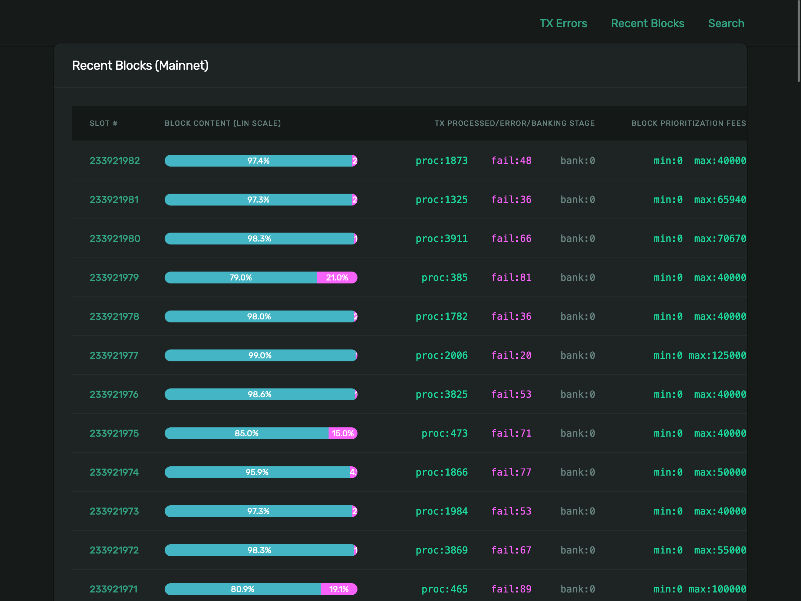
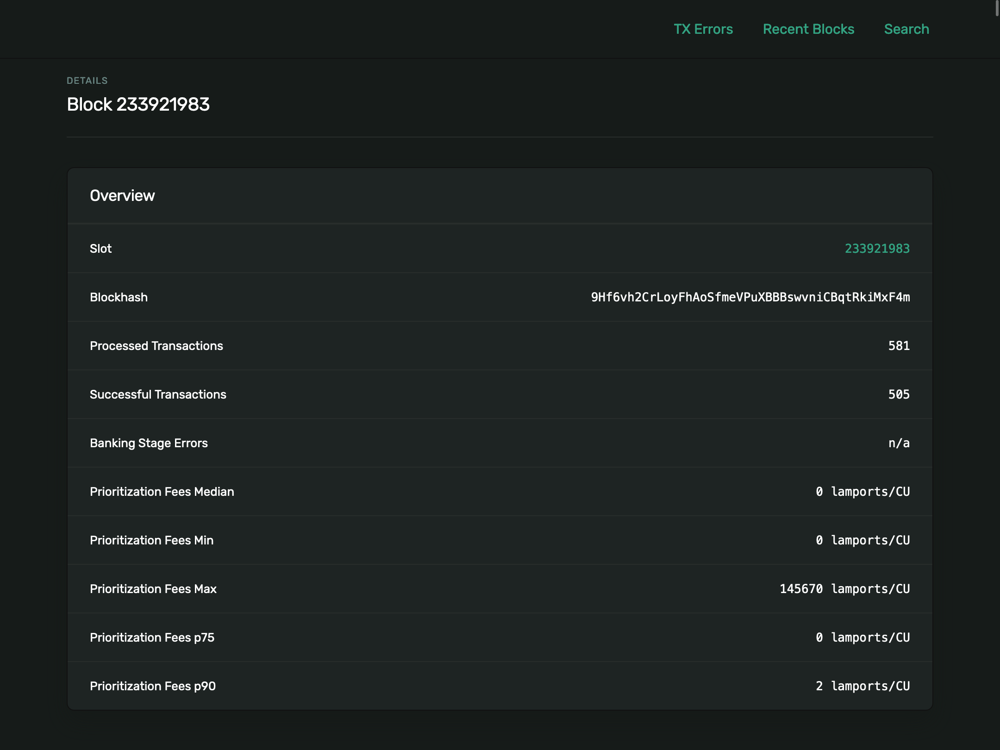
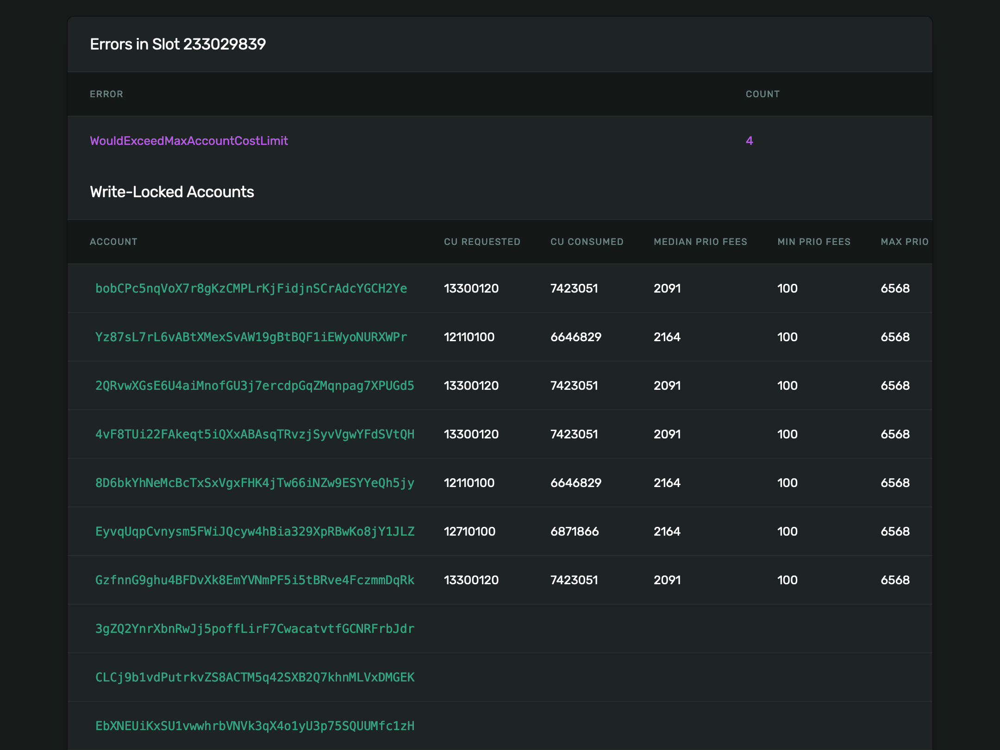
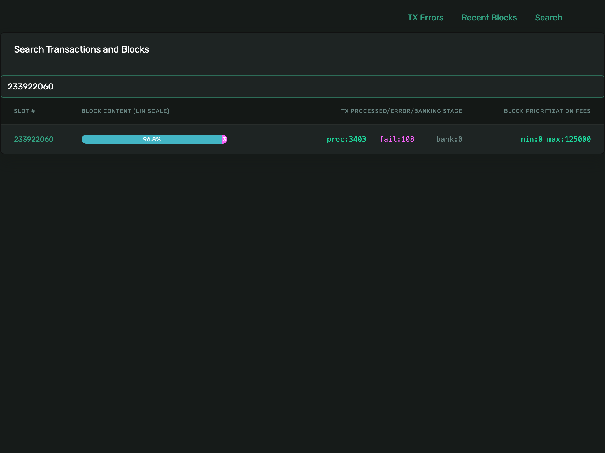

## Solana Banking Stage Inspection Dashboard

### Status
Production - contact us for Link

### Screenshots

#### List of Transaction errors



##### Transaction details with heavily write-locked accounts



##### List of Blocks with fill rate / errors / total tx



##### Block details



##### Block details with heavily write-locked accounts




#### Search for a Block/Transaction by Slot Number/Signature



### Recent Blocks - stop refreshing
The auto-refresh can be stopped by appending parameter `to_slot` to the URL: `/recent-blocks?to_slot=232135000`

### Local Development
**Caution:** Port `5000` cannot be used on MacOS.

```
# Unix/macOS
python3 -m venv .venv
source .venv/bin/activate
SOLANA_CLUSTER=testnet POOLED_DB_MAX_SIZE=4 PGDATABASE=da11copy PGUSER=query_user PGPASSWORD=secret TEMPLATES_AUTO_RELOAD=True flask run --port 5050 --debug --reload
```

Use this to test with _gunicorn_: 
* ___CAUTION___: did not figure out how to enable template reloading
```
SOLANA_CLUSTER=testnet POOLED_DB_MAX_SIZE=4 PGDATABASE=da11copy PGPORT=5432 PGUSER=query_user PGPASSWORD=secret gunicorn app:webapp --workers 1 --threads 30 --bind :5050 --reload
```

Open Firefox Browser and navigate to ...
* [Dashboard](http://localhost:5050/dashboard)
* [Tx Errors](http://localhost:5050/tx-errors)
* [Recent Blocks](http://localhost:5050/recent-blocks)
* [Search for one Block or Transaction](http://localhost:5050/search)

### Deployment
#### Limits
| Description                         | System      | Variable               | Config     |
|-------------------------------------|-------------|------------------------|------------|
| Max number of PostgreSQL connections | Application | POOLED_DB_MAX_SIZE     | fly.toml   |
| Limit of HTTP Requests              | fly.io      | soft_limit             | fly.toml   |
| Hard Limit of HTTP Requests         | fly.io      | hard_limit             | fly.toml   |
| Python HTTP Server                  | gunicorn    | --workers, --threads | Dockerfile |

### Data Model
Conventions:

| Table Name       | Alias   |
|------------------|---------|
| transaction_slot | tx_slot |
| accounts_map_blocks | amb     |
| transaction_infos | txi     |
| blocks | blocks  |
| accounts_map_transaction | amt     |
| transaction_slot | tx_slot |
|                  |         |