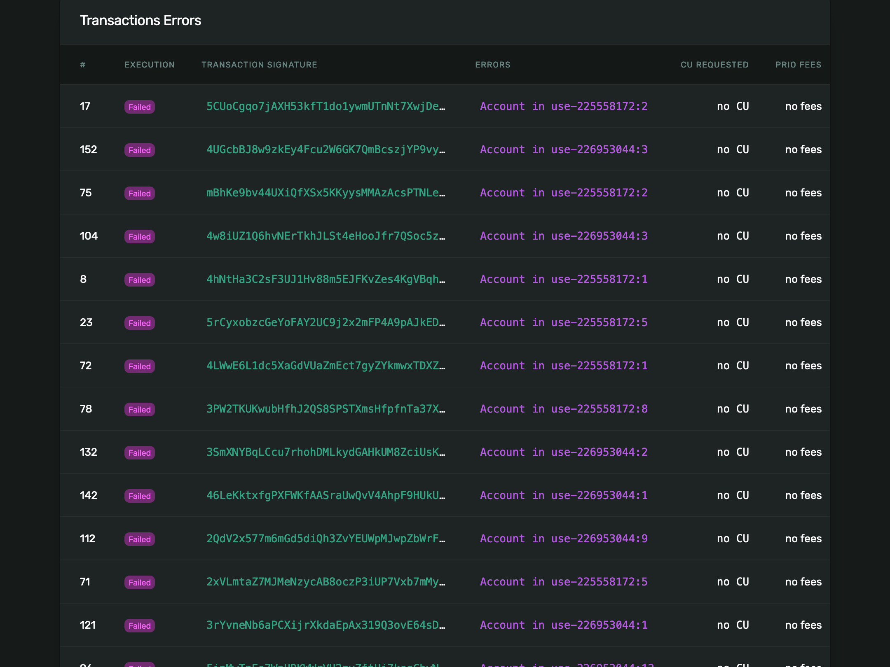
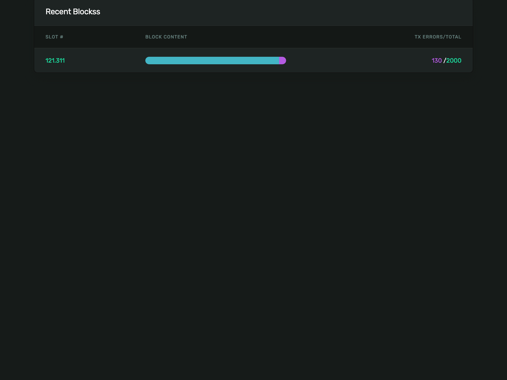

## Solana Tx Error Page!

### Status
Pre-alpha / demo only

### Screenshots

#### Transaction errors with messages


##### Blocks fill rate / errors / total tx



### Development
**Caution:** Port `5000` cannot be used on MacOS.

```
# Unix/macOS
python3 -m venv .venv
source .venv/bin/activate
SOLANA_CLUSTER=testnet PGDATABASE=da11copy PGUSER=query_user PGPASSWORD=secret TEMPLATES_AUTO_RELOAD=True flask run --port 5050 --debug --reload
```

Open Firefox Browser and navigate to ...
* [Dashboard](http://localhost:5050/dashboard)
* [Blocks and Tx Errors](http://localhost:5050/recent-blocks)

